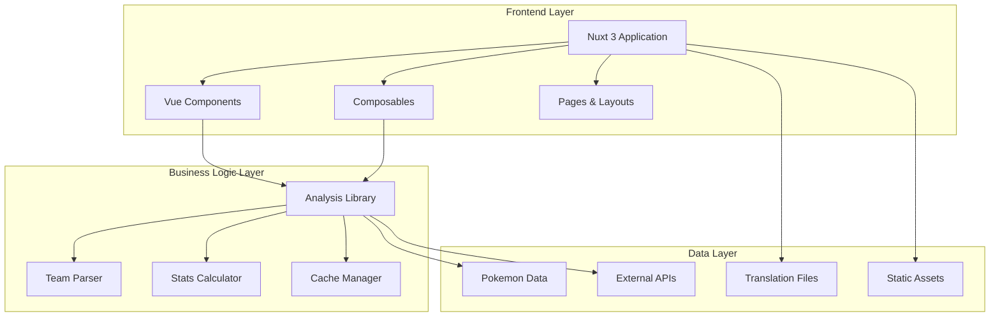
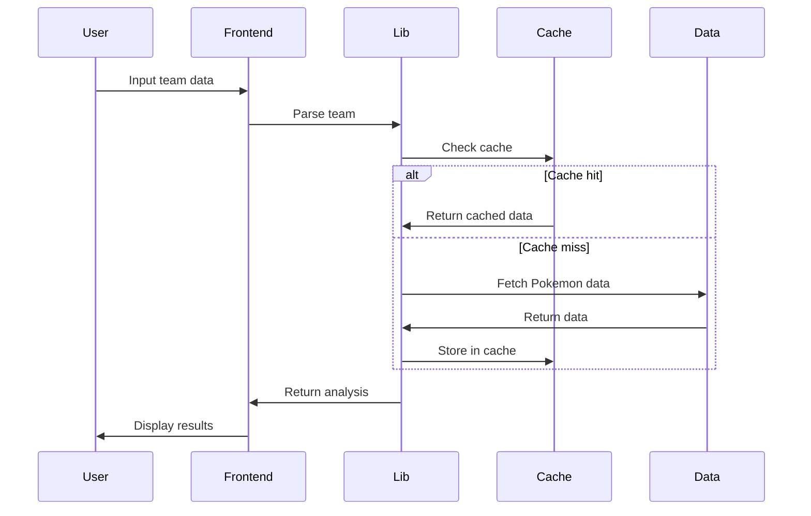

# Pokemon Team Analysis - Architecture Guide

This document outlines the system architecture, design patterns, and technical decisions behind the Pokemon Team Analysis application.

## 🏛️ System Overview

The Pokemon Team Analysis application is built using a **modern full-stack architecture** with clear separation of concerns:



## 🎯 Design Principles

### 1. **Separation of Concerns**
- **Frontend**: UI/UX, user interactions, presentation logic
- **Business Logic**: Analysis algorithms, data processing, calculations
- **Data**: Pokemon data, translations, static content

### 2. **Modularity**
- Each module has a single responsibility
- Clear interfaces between modules
- Easy to test and maintain

### 3. **Performance First**
- Caching at multiple levels
- Lazy loading and code splitting
- Optimized bundle sizes

### 4. **Internationalization**
- Multi-language support from the ground up
- SEO optimization for all languages
- Proper locale handling

### 5. **Type Safety**
- Full TypeScript coverage
- Strict type checking
- Runtime validation where needed

## 🏗️ Architecture Layers

### Frontend Layer (Nuxt 3)

#### **Application Structure**
```
frontend/
├── pages/              # File-based routing
├── layouts/            # Layout templates
├── components/         # Vue components
│   ├── global/        # Auto-imported components
│   ├── layout/        # Layout-specific components
│   └── ui/            # Reusable UI components
├── composables/        # Reusable logic
├── middleware/         # Route middleware
├── plugins/           # Nuxt plugins
└── assets/            # Static assets
```

#### **Key Technologies**
- **Nuxt 3**: Full-stack Vue framework with SSR/SSG
- **Vue 3**: Composition API for better logic reuse
- **TypeScript**: Type safety and better DX
- **Tailwind CSS**: Utility-first styling
- **Lucide Icons**: Consistent iconography

#### **Rendering Strategy**
- **SSR (Server-Side Rendering)**: For SEO and initial load performance
- **SPA (Single Page Application)**: For interactive pages
- **SSG (Static Site Generation)**: For static content pages

### Business Logic Layer (lib/)

#### **Core Modules**

1. **Analysis Engine** (`analyzer/`)
   - Resistance analysis for defensive capabilities
   - Coverage analysis for offensive capabilities
   - Extensible analyzer architecture

2. **Calculation Engine** (`calculator/`)
   - Pokemon stats calculations
   - Nature and EV/IV handling
   - Performance optimized formulas

3. **Parsing Engine** (`parser/`)
   - Team string parsing
   - Format validation
   - Data normalization

4. **Core Infrastructure** (`core/`)
   - Caching system
   - Data services
   - Type definitions
   - Utilities

#### **Design Patterns**

1. **Factory Pattern**: Format initialization
2. **Strategy Pattern**: Different analysis strategies
3. **Observer Pattern**: Cache events and monitoring
4. **Singleton Pattern**: Cache manager and data service
5. **Builder Pattern**: Complex object construction

### Data Layer

#### **Data Sources**
- **@pkmn libraries**: Pokemon data and mechanics
- **Static JSON files**: Translations and mappings
- **Runtime cache**: Computed results and API responses

#### **Data Flow**


## 🔧 Key Components

### 1. Cache Management System

**Multi-level caching strategy**:
- **L1 Cache**: In-memory LRU cache for hot data
- **L2 Cache**: Compressed storage for large objects
- **L3 Cache**: Persistent storage (future enhancement)

**Cache Policies**:
- **Static data**: 24 hours (Pokemon base stats, types)
- **Analysis results**: 1 hour (team analysis cache)
- **User data**: 30 minutes (preferences, settings)
- **Temporary data**: 5 minutes (API responses)

### 2. Internationalization System

**Multi-layer i18n architecture**:
```
i18n/
├── locales/           # Application translations
│   ├── en.json       # English (base)
│   ├── ja.json       # Japanese
│   ├── ko.json       # Korean
│   ├── zh-hans.json  # Simplified Chinese
│   └── zh-hant.json  # Traditional Chinese
└── data/             # Pokemon data translations
    ├── species_i18n.json
    ├── move_i18n.json
    ├── ability_i18n.json
    └── item_i18n.json
```

**Features**:
- Lazy loading of translation files
- Fallback to English for missing translations
- SEO optimization with proper hreflang tags
- URL localization with language prefixes

### 3. Component Architecture

**Component Hierarchy**:
```
App
├── Layout (default.vue)
│   ├── Header
│   │   ├── Navigation
│   │   └── LanguageSwitcher
│   ├── Main Content
│   │   ├── Pages
│   │   └── Components
│   └── Footer
└── Global Components
    ├── LoadingSpinner
    ├── ConfirmDialog
    └── CookieConsent
```

**Component Categories**:
- **Layout Components**: Header, Footer, Navigation
- **UI Components**: Buttons, Forms, Modals, Cards
- **Business Components**: PokemonCard, TeamEditor, AnalysisResults
- **Global Components**: Error handlers, Loading states

### 4. State Management

**Composable-based state management**:
- `useTeamStorage`: Team data persistence
- `useUserPreferences`: User settings and preferences
- `useClientState`: Client-side reactive state
- `useCookieConsent`: GDPR compliance
- `useNavigation`: Navigation state

**Benefits**:
- No external state library needed
- Better tree-shaking
- Type-safe state management
- Easy testing and debugging

## 🚀 Performance Optimizations

### 1. **Bundle Optimization**
```typescript
// nuxt.config.ts
build: {
  rollupOptions: {
    output: {
      manualChunks: {
        pokemon: ['@pkmn/data', '@pkmn/dex', '@pkmn/sets', '@pkmn/sim'],
        ui: ['lucide-vue-next']
      }
    }
  }
}
```

### 2. **Image Optimization**
- WebP format with fallbacks
- Responsive images with `@nuxt/image`
- Lazy loading for non-critical images

### 3. **Code Splitting**
- Route-based code splitting
- Component lazy loading
- Dynamic imports for heavy libraries

### 4. **Caching Strategy**
- Browser caching for static assets
- Service worker for offline support (future)
- CDN caching for global distribution

## 🔒 Security Considerations

### 1. **Input Validation**
- Team string sanitization
- XSS prevention in user inputs
- CSRF protection for forms

### 2. **Data Privacy**
- GDPR compliant cookie consent
- No personal data collection
- Local storage for team data

### 3. **Content Security**
- CSP headers for XSS protection
- Secure asset loading
- Safe HTML rendering

## 📊 Monitoring & Analytics

### 1. **Performance Monitoring**
- Cache hit rates and performance metrics
- Bundle size monitoring
- Core Web Vitals tracking

### 2. **User Analytics** (Optional)
- Google Analytics 4 integration
- Privacy-respecting analytics
- User consent required

### 3. **Error Tracking**
- Client-side error handling
- Graceful degradation
- User-friendly error messages

## 🔮 Future Enhancements

### 1. **Technical Improvements**
- **Progressive Web App**: Offline support and app-like experience
- **Real-time Updates**: WebSocket integration for live analysis
- **Advanced Caching**: Redis for distributed caching
- **API Layer**: REST/GraphQL API for external integrations

### 2. **Feature Enhancements**
- **Team Builder**: Visual Pokemon team builder
- **Battle Simulator**: Damage calculations and battle simulation
- **Meta Analysis**: Current meta trends and statistics
- **User Accounts**: Save teams and analysis history

### 3. **Infrastructure**
- **Microservices**: Split into smaller, focused services
- **Container Deployment**: Docker and Kubernetes
- **CI/CD Pipeline**: Automated testing and deployment
- **Monitoring**: Application performance monitoring

## 🧪 Testing Strategy

### 1. **Unit Testing**
- Core library functions
- Utility functions
- Component logic

### 2. **Integration Testing**
- API endpoints
- Data flow between layers
- Cache functionality

### 3. **E2E Testing**
- User workflows
- Cross-browser compatibility
- Performance testing

### 4. **Translation Testing**
- Translation consistency validation
- Missing key detection
- Automated translation checks

## 📈 Scalability Considerations

### 1. **Horizontal Scaling**
- Stateless application design
- CDN for static asset distribution
- Load balancing ready

### 2. **Vertical Scaling**
- Efficient memory usage
- CPU optimization
- Database query optimization

### 3. **Caching Scaling**
- Distributed caching
- Cache invalidation strategies
- Memory management

This architecture provides a solid foundation for the Pokemon Team Analysis application while maintaining flexibility for future enhancements and scaling needs.
